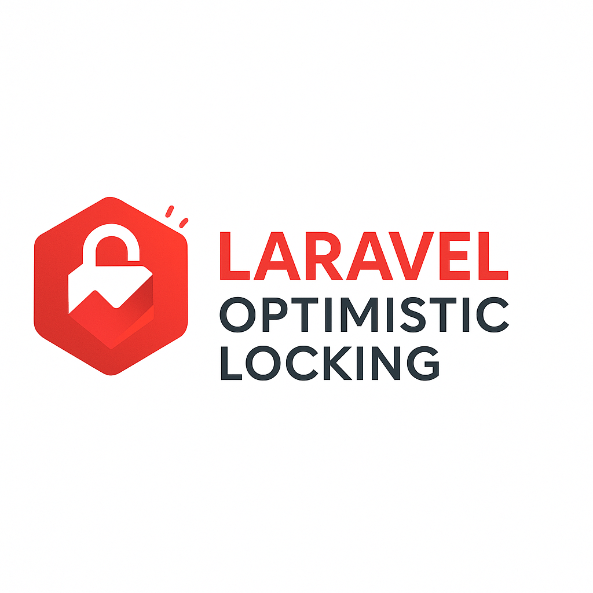

# Optimistic Locking

Utilities for implementing optimistic locking in Laravel Eloquent models.

## Features

- `OptimisticLocking` trait increments a version column every time a model is updated.
- `StaleModelException` is thrown when an outdated model instance is saved and exposes the changed values via `diff()`.
- Artisan command `schema:lock --apply` adds the locking column to tables under `app/Models`.
- Fully configurable column name, start value and diff length.

## Requirements

- PHP 8.1+
- Laravel 10, 11 or 12

## Installation

Install the package via composer:

```bash
composer require andreaskviby/optimistic-locking
```

Publish the configuration file to customise the column name or initial value:

```bash
php artisan vendor:publish --tag="optimistic-locking-config"
```

Add a locking column to your tables. Either run the command that scans your models:

```bash
php artisan schema:lock --apply
```

or add the column manually in your migrations:

```php
$table->unsignedInteger('lock_version')->nullable();
```

## Usage

Apply the trait to any model that needs optimistic locking:

```php
use Stafe\OptimisticLocking\Traits\OptimisticLocking;

class Post extends Model
{
    use OptimisticLocking;
}
```

When a stale model instance is saved the package throws a `StaleModelException`:

```php
try {
    $post->save();
} catch (Stafe\OptimisticLocking\StaleModelException $e) {
    logger()->warning('Stale update', $e->diff());
}
```

## Configuration

The published configuration file looks like this:

```php
return [
    'column' => 'lock_version',
    'start_value' => 1,
    'diff_max_len' => 250,
];
```

Adjust these options to match your application.

## Testing

```bash
composer test
```

## Changelog

See [CHANGELOG](CHANGELOG.md) for a record of changes.

## Contributing

Pull requests are welcome. For major changes, please open an issue first to discuss what you would like to change.

We are actively looking for issues, pull requests and contributors.

## Developer

The project is developed by [Andreas Kviby](https://github.com/andreaskviby).

## Security

If you discover a security vulnerability, please contact the maintainer at developer@example.com.

## License

The MIT License. See [LICENSE.md](LICENSE.md) for details.

